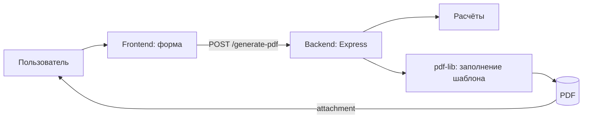

/**
 * @file: Project.md
 * @description: Детальное описание проекта веб-сервиса заполнения PDF-шаблона расчетными данными с упором на безопасность, производительность и поддерживаемость.
 * @dependencies: server.js, public/, pattern1.pdf, package.json, тестовые скрипты
 * @created: 2025-09-13
 */

## Назначение и цели
Проект реализует веб‑сервис, который принимает исходные данные, выполняет расчёты и заполняет PDF‑шаблон `pattern1.pdf` относительно текстовых меток:
- msr: — справа подставляется максимальный суточный расход воды (м3/час) и, во второй позиции метки msr:, максимальный секундный расход (л/сек)
- n: — справа подставляется установленный насос (марка)
- sh: — справа подставляется шифр проекта
- mchr: — справа подставляется максимальный часовой расход

Ключевые цели:
- Консистентное и корректное заполнение PDF относительно маркеров
- Простая интеграция фронтенда и бэкенда
- Высокая поддерживаемость, тестируемость и расширяемость
- Безопасная обработка входных данных и предсказуемая производительность

## Область применения
- Локальное и серверное использование для автоматизации подготовки проектной документации
- Генерация PDF на лету без сохранения персональных данных

## Архитектура (высокий уровень)
Компоненты:
- Frontend (Vanilla JS + HTML/CSS, `public/`): форма ввода, валидация, вызов API, загрузка PDF
- Backend (Node.js + Express, `server.js`): валидация, расчёты, генерация PDF, логирование
- PDF Processing (pdf-lib): загрузка `pattern1.pdf`, отрисовка значений относительно меток



## API
- POST `/generate-pdf`
  - Request (JSON):
    - dailyConsumption (number, м3/сут)
    - pumpModel (string)
    - projectCode (string)
  - Response: application/pdf (attachment)
  - Валидация: типы, диапазоны, длина строк; HTTP 400 при ошибке

## Бизнес‑логика расчётов
- Максимальный часовой расход: `hourly = 3.9 * dailyConsumption / 24`
- Максимальный секундный расход: `secondly = hourly / 3.6`
- Округление: по банковскому правилу до 2 знаков после запятой (конфигурируемо)

## Заполнение PDF относительно меток
Требование: значения должны быть размещены справа от текстовых меток в `pattern1.pdf`.

Подходы:
1) Якоря по координатам (рекомендуемо для стабильности производительности):
   - Один раз определить координаты текстов меток (страница, x, y) вручную или через вспомогательный скрипт
   - Хранить их в `config/markers.json`:
     ```json
     {
       "msr_daily": {"page": 0, "x": 120, "y": 540, "dx": 6, "dy": 0},
       "n": {"page": 0, "x": 120, "y": 510, "dx": 6, "dy": 0},
       "sh": {"page": 0, "x": 120, "y": 480, "dx": 6, "dy": 0},
       "mchr": {"page": 0, "x": 120, "y": 450, "dx": 6, "dy": 0},
       "msr_secondly": {"page": 0, "x": 120, "y": 420, "dx": 6, "dy": 0}
     }
     ```
   - Рендерить значение на координате (x + dx, y + dy) с выбранным шрифтом и размером
2) Поиск текста метки на лету:
   - Использовать парсинг текста (например, pdfjs-dist) для нахождения позиций «msr:», «n:», «sh:», «mchr:»
   - Кэшировать найденные координаты и отрисовывать справа с отступом

Рекомендация: начать с варианта 1 (быстрее, предсказуемее), добавить 2 как опциональный модуль при изменении шаблона.

Правила отрисовки:
- Совместимый шрифт (встроенный стандартный или эмбед шрифта) и одинаковый размер для консистентности
- Отступ справа `dx` настраиваемый, чтобы визуально примыкать к метке
- Нормализовать локаль чисел (запятая/точка) согласно требованиям документа

## Нефункциональные требования
- Безопасность:
  - Валидация входных данных (тип, диапазоны, длина)
  - Ограничение размера запроса
  - CORS только для доверенного происхождения (по умолчанию localhost)
  - Rate limiting по IP
  - Исключить загрузку произвольных PDF от пользователя (используется фиксированный шаблон)
- Производительность:
  - Генерация PDF < 300 мс на средних данных локально
  - Кэширование загруженного `pattern1.pdf` в памяти процесса
  - Потоковая отдача ответа
- Надёжность и поддерживаемость:
  - Покрытие юнит‑тестами расчётов и маппинга меток
  - Логирование ошибок и ключевых событий
  - Чёткая конфигурация через `.env`/`config/*.json`

## Стандарты разработки
- Принципы: SOLID, KISS, DRY
- Стиль кода: единый линтер (например, ESLint + Prettier), pre-commit hooks
- Code review на все изменения
- Отсутствие неиспользуемого кода и комментариев

## Структура проекта (целевое)
```
projectPZpdf1/
  server.js
  public/
  pattern1.pdf
  config/
    markers.json         # координаты якорей
  docs/
    Project.md
    Tasktracker.md
    Diary.md
    qa.md
    changelog.md
  tests/
    calculations.test.js
    pdf-fill.test.js
  package.json
```

## Обработка ошибок и логирование
- Единый формат ответа об ошибках `{ code, message, details? }`
- 400 — ошибки валидации; 500 — внутренние ошибки
- Логирование: уровень info для успешной генерации, warn для нештатных ситуаций, error для исключений

## Тестирование
- Юнит‑тесты: функции расчёта, модуль преобразования чисел/округления, модуль рендеринга по координатам
- Интеграционные: энд‑ту‑энд `/generate-pdf` с фикстурами
- Регресс: визуальная проверка сэтов данных, сравнение размеров/страниц PDF

## Конфигурация
- `.env`: PORT, CORS_ORIGIN, RATE_LIMIT
- `config/markers.json`: координаты и отступы монтажа значений относительно меток
- Локализация числовых форматов: через конфиг `NUMBER_LOCALE`

## Дорожная карта
- V0: базовый API, расчёты, жёстко заданные координаты меток, тесты
- V1: скрипт автодетекции меток (pdfjs‑dist), кэш координат
- V2: предпросмотр PDF на фронтенде, загрузка кастомных шрифтов

## Риски и смягчения
- Изменение шаблона PDF — несоответствие координат → версияция `markers.json`, автодетекция
- Отсутствие шрифтов → эмбед стандартного шрифта, fallback
- Нагрузки → кэш шаблона, отключение лишних аллокаций, стриминг

## Обновление документа
Этот документ необходимо обновлять при изменениях архитектуры, API, шаблона PDF, правил безопасности/производительности и при добавлении новых функциональных требований.
