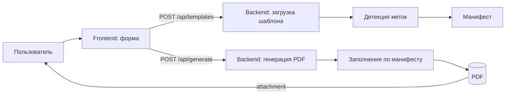

/**
 * @file: Project.md
 * @description: Детальное описание проекта веб-сервиса заполнения PDF-шаблона расчетными данными с упором на безопасность, производительность и поддерживаемость.
 * @dependencies: server.js, public/, pattern1.pdf, package.json, тестовые скрипты
 * @created: 2025-09-13
 */

## Назначение и цели
Проект реализует веб‑сервис, который принимает исходные данные, выполняет расчёты и заполняет PDF‑шаблон `pattern1.pdf` относительно текстовых меток:
- msr: — справа подставляется максимальный суточный расход воды (м3/час) и, во второй позиции метки msr:, максимальный секундный расход (л/сек)
- n: — справа подставляется установленный насос (марка)
- sh: — справа подставляется шифр проекта
- mchr: — справа подставляется максимальный часовой расход

Ключевые цели:
- Консистентное и корректное заполнение PDF относительно маркеров
- Простая интеграция фронтенда и бэкенда
- Высокая поддерживаемость, тестируемость и расширяемость
- Безопасная обработка входных данных и предсказуемая производительность

## Область применения
- Локальное и серверное использование для автоматизации подготовки проектной документации
- Генерация PDF на лету без сохранения персональных данных

## Архитектура (высокий уровень)
Компоненты:
- Frontend (Vanilla JS + HTML/CSS, `public/`): форма ввода, валидация, вызов API, загрузка PDF
- Backend (Node.js + Express, `backend/`): модульная архитектура с API для пользовательских шаблонов
- PDF Processing (pdf-lib + pdfjs-dist): авто-детекция меток, заполнение значений относительно маркеров
- Storage (`backend/storage/`): шаблоны, манифесты, выходные файлы



## API

### POST `/api/templates`
- **Описание**: Загрузка PDF шаблона и генерация манифеста
- **Request**: multipart/form-data с полем `file` (PDF)
- **Response**: `{ success: true, templateId: string, manifest: Object }`
- **Валидация**: только PDF файлы, максимум 10MB

### GET `/api/templates/:id/manifest`
- **Описание**: Получение манифеста шаблона по ID
- **Response**: `{ success: true, manifest: Object }`
- **Ошибки**: 404 если шаблон не найден

### POST `/api/generate`
- **Описание**: Генерация PDF с заполненными данными
- **Request (JSON)**:
  - `templateId` (string) - ID шаблона
  - `values` (Object) - данные для заполнения
  - `options` (Object, optional) - параметры отрисовки
- **Response**: application/pdf (attachment)
- **Валидация**: типы, диапазоны, длина строк; HTTP 400 при ошибке

## Бизнес‑логика расчётов
- Максимальный часовой расход: `hourly = 3.9 * dailyConsumption / 24`
- Максимальный секундный расход: `secondly = hourly / 3.6`
- Округление: по банковскому правилу до 2 знаков после запятой (конфигурируемо)

## Заполнение PDF относительно меток
Требование: значения должны быть размещены справа от текстовых меток в пользовательских PDF шаблонах.

### Гибридный подход (реализован):
1) **Авто-детекция меток** (pdfjs-dist):
   - Сканирование PDF при загрузке шаблона
   - Поиск текстовых маркеров: `msr:`, `n:`, `sh:`, `mchr:`
   - Вычисление координат "справа от метки" с отступом
   - Кэширование в манифесте для быстрого доступа

2) **Поддержка AcroForm** (pdf-lib):
   - Если в шаблоне есть поля с именами меток - используем их напрямую
   - Fallback на текстовую отрисовку если поля отсутствуют

3) **Обработка дубликатов**:
   - Маркер `msr:` встречается дважды
   - Привязка по порядку: 1-й → `msr_daily`, 2-й → `msr_secondly`

### Стандарт меток:
- Поддерживаются форматы: `{{name}}` (предпочтительно) и `name:` (обратная совместимость)
- Требование: уникальные имена полей
- Автоматическое определение координат при загрузке шаблона

Правила отрисовки:
- Совместимый шрифт (встроенный стандартный или эмбед шрифта) и одинаковый размер для консистентности
- Отступ справа `dx` настраиваемый, чтобы визуально примыкать к метке
- Нормализовать локаль чисел (запятая/точка) согласно требованиям документа

## Нефункциональные требования
- Безопасность:
  - Валидация входных данных (тип, диапазоны, длина)
  - Ограничение размера запроса
  - CORS только для доверенного происхождения (по умолчанию localhost)
  - Rate limiting по IP
  - Исключить загрузку произвольных PDF от пользователя (используется фиксированный шаблон)
- Производительность:
  - Генерация PDF < 300 мс на средних данных локально
  - Кэширование загруженного `pattern1.pdf` в памяти процесса
  - Потоковая отдача ответа
- Надёжность и поддерживаемость:
  - Покрытие юнит‑тестами расчётов и маппинга меток
  - Логирование ошибок и ключевых событий
  - Чёткая конфигурация через `.env`/`config/*.json`

## Стандарты разработки
- Принципы: SOLID, KISS, DRY
- Стиль кода: единый линтер (например, ESLint + Prettier), pre-commit hooks
- Code review на все изменения
- Отсутствие неиспользуемого кода и комментариев

## Структура проекта (текущая)
```
projectPZpdf1/
  backend/
    app.js              # Основное Express приложение
    src/
      api/
        routes.js       # API маршруты
      services/
        templateService.js # Сервис работы с шаблонами
      utils/
        pdfProcessor.js # Обработка PDF (детекция, заполнение)
      models/
        Manifest.js     # Схема манифеста
    storage/
      templates/        # Загруженные PDF шаблоны
      manifests/        # Кэш манифестов
      output/          # Сгенерированные PDF
  public/              # Frontend (статические файлы)
  docs/
    Project.md
    Tasktracker.md
    Diary.md
    qa.md
    changelog.md
  package.json
```

## Обработка ошибок и логирование
- Единый формат ответа об ошибках `{ code, message, details? }`
- 400 — ошибки валидации; 500 — внутренние ошибки
- Логирование: уровень info для успешной генерации, warn для нештатных ситуаций, error для исключений

## Тестирование
- Юнит‑тесты: функции расчёта, модуль преобразования чисел/округления, модуль рендеринга по координатам
- Интеграционные: энд‑ту‑энд `/generate-pdf` с фикстурами
- Регресс: визуальная проверка сэтов данных, сравнение размеров/страниц PDF

## Конфигурация
- `.env`: PORT, CORS_ORIGIN, RATE_LIMIT
- `config/markers.json`: координаты и отступы монтажа значений относительно меток
- Локализация числовых форматов: через конфиг `NUMBER_LOCALE`

## Дорожная карта
- V0: базовый API, расчёты, жёстко заданные координаты меток, тесты
- V1: скрипт автодетекции меток (pdfjs‑dist), кэш координат
- V2: предпросмотр PDF на фронтенде, загрузка кастомных шрифтов

## Риски и смягчения
- Изменение шаблона PDF — несоответствие координат → версияция `markers.json`, автодетекция
- Отсутствие шрифтов → эмбед стандартного шрифта, fallback
- Нагрузки → кэш шаблона, отключение лишних аллокаций, стриминг

## Обновление документа
Этот документ необходимо обновлять при изменениях архитектуры, API, шаблона PDF, правил безопасности/производительности и при добавлении новых функциональных требований.
